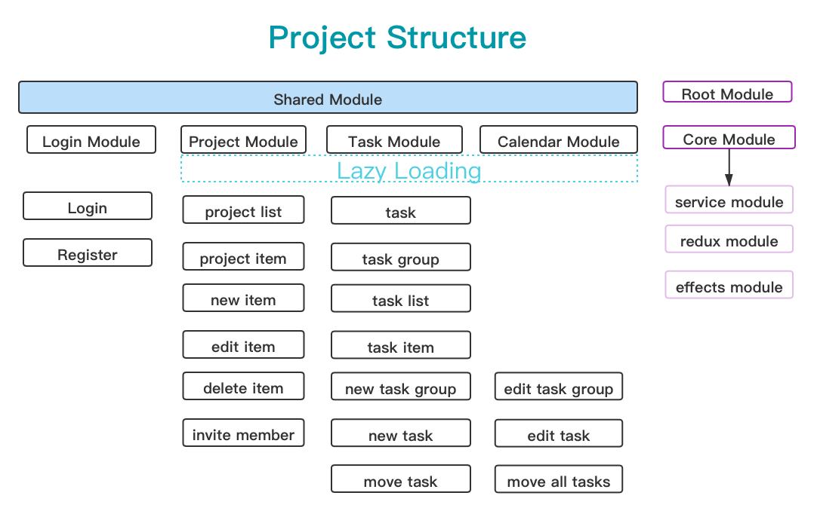
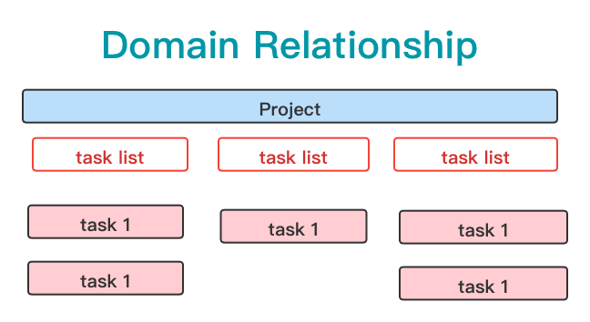
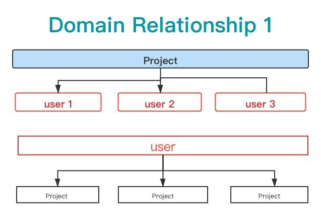
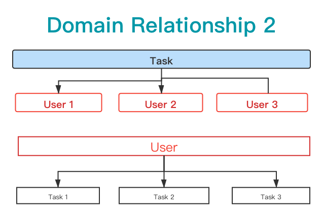

## Workflow in Angular

This project will use Anular package to create one project to simulate the workflow.

we create the core module and load once .

The whole project layout and components are created by Material-Angular lib.
I use the iconfont website to load svg and save the icons in assets directory. I create one svg loading function in
utils directory, in which the svg-loading utils are used in core.module.ts, and these tools will use only once.

it will go on..
